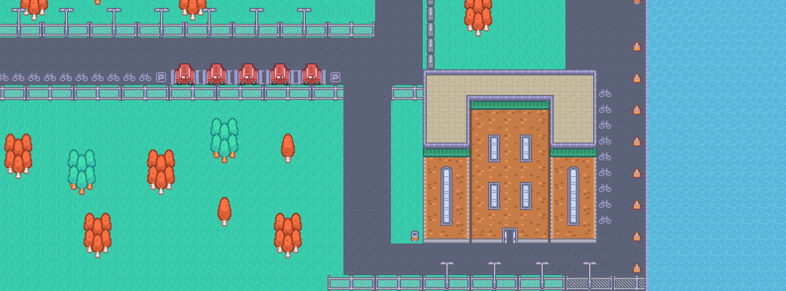
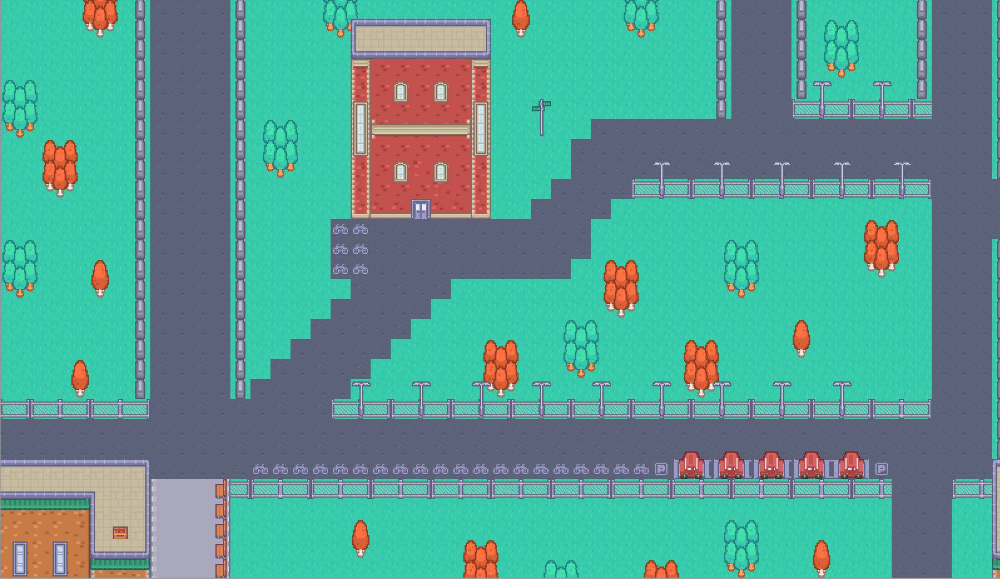

<a href="https://github.com/Team-12-ENG1/HeslingtonHustle2.git" style="background-color: black; color: white; padding: 10px 10px; text-decoration: none; border-radius: 5px; font-family: sans-serif; font-weight: bold; display: inline-block; margin-bottom: 1cm;">View our project's GitHub here</a>

<a href="https://drive.google.com/file/d/1uWFpuNFwbp2wkDN4zGPN6JxYuojb1q_F/view" style="background-color: black; color: white; padding: 10px 10px; text-decoration: none; border-radius: 5px; font-family: sans-serif; font-weight: bold; display: inline-block; margin-bottom: 1cm;">Download JAR (Google Drive)</a>

<a href="https://lukehcjackson.github.io/HeslingtonHustleG15/docs/HesHus-new-main-5.zip" style="background-color: black; color: white; padding: 10px 10px; text-decoration: none; border-radius: 5px; font-family: sans-serif; font-weight: bold; display: inline-block; margin-bottom: 1cm;">Download our code as a .zip</a>

# Updated Deliverables

<a href="docs/New files/CI2.pdf" style="background-color: black; color: white; padding: 10px 10px; text-decoration: none; border-radius: 5px; font-family: sans-serif; font-weight: bold; display: inline-block; margin-bottom: 1cm;">Change Report</a>

<a href="docs/New files/Req2.pdf" style="background-color: black; color: white; padding: 10px 10px; text-decoration: none; border-radius: 5px; font-family: sans-serif; font-weight: bold; display: inline-block; margin-bottom: 1cm;">Requirements 2</a>

<a href="docs/New files/Arch2.pdf" style="background-color: black; color: white; padding: 10px 10px; text-decoration: none; border-radius: 5px; font-family: sans-serif; font-weight: bold; display: inline-block; margin-bottom: 1cm;">Architecture 2</a>

<a href="docs/New files/ArchitecturePreviousVersions.pdf" style="background-color: darkblue; color: white; padding: 10px 10px; text-decoration: none; border-radius: 5px; font-family: sans-serif; font-weight: bold; display: inline-block; margin-bottom: 1cm;">Interim Architecture Versions</a>

<a href="docs/New files/Risk2.pdf" style="background-color: black; color: white; padding: 10px 10px; text-decoration: none; border-radius: 5px; font-family: sans-serif; font-weight: bold; display: inline-block; margin-bottom: 1cm;">Risk Assessment and Mitigation 2</a>

<a href="docs/New files/Imp2.pdf" style="background-color: black; color: white; padding: 10px 10px; text-decoration: none; border-radius: 5px; font-family: sans-serif; font-weight: bold; display: inline-block; margin-bottom: 1cm;">Implementation 2</a>

<a href="docs/New files/CI2.pdf" style="background-color: black; color: white; padding: 10px 10px; text-decoration: none; border-radius: 5px; font-family: sans-serif; font-weight: bold; display: inline-block; margin-bottom: 1cm;">Contigious Integration</a>

<a href="docs/New files/Eval2.pdf" style="background-color: black; color: white; padding: 10px 10px; text-decoration: none; border-radius: 5px; font-family: sans-serif; font-weight: bold; display: inline-block; margin-bottom: 1cm;">User Evalutation</a>

## Testing
<a href="docs/New files/Test2.pdf" style="background-color: black; color: white; padding: 10px 10px; text-decoration: none; border-radius: 5px; font-family: sans-serif; font-weight: bold; display: inline-block; margin-bottom: 1cm;">Testing 2</a>

<a href="http://htmlpreview.github.io/?https://Team-12-ENG1.github.io/docs/coverage-report/index.html" style="background-color: black; color: white; padding: 10px 10px; text-decoration: none; border-radius: 5px; font-family: sans-serif; font-weight: bold; display: inline-block; margin-bottom: 1cm;">Coverage Report</a>

<a href="http://htmlpreview.github.io/?https://Team-12-ENG1.github.io/docs/test/index.html" style="background-color: black; color: white; padding: 10px 10px; text-decoration: none; border-radius: 5px; font-family: sans-serif; font-weight: bold; display: inline-block; margin-bottom: 1cm;">Test Results</a>

<a href="docs/New files/test-cases.pdf" style="background-color: black; color: white; padding: 10px 10px; text-decoration: none; border-radius: 5px; font-family: sans-serif; font-weight: bold; display: inline-block; margin-bottom: 1cm;">Manual Test Cases</a>

<a href="docs/New files/Gantt Charts.pdf" style="background-color: black; color: white; padding: 10px 10px; text-decoration: none; border-radius: 5px; font-family: sans-serif; font-weight: bold; display: inline-block; margin-bottom: 1cm;">Gantt Charts</a>

# Previous Deliverables

<a href="docs/Previous Files/Req1.pdf" style="background-color: black; color: white; padding: 10px 10px; text-decoration: none; border-radius: 5px; font-family: sans-serif; font-weight: bold; display: inline-block; margin-bottom: 1cm;">Requirements</a>

<a href="docs/Previous Files/Arch1.pdf" style="background-color: black; color: white; padding: 10px 10px; text-decoration: none; border-radius: 5px; font-family: sans-serif; font-weight: bold; display: inline-block; margin-bottom: 1cm;">Architecture</a>

<a href="docs/Previous Files/Plan1.pdf" style="background-color: black; color: white; padding: 10px 10px; text-decoration: none; border-radius: 5px; font-family: sans-serif; font-weight: bold; display: inline-block; margin-bottom: 1cm;">Method Selection and Planning</a>

<a href="docs/Previous Files/Risk1.pdf" style="background-color: black; color: white; padding: 10px 10px; text-decoration: none; border-radius: 5px; font-family: sans-serif; font-weight: bold; display: inline-block; margin-bottom: 1cm;">Risk Assessment and Mitigation</a>

<a href="docs/Previous Files/RiskReassessment.jpg" style="background-color: darkblue; color: white; padding: 10px 10px; text-decoration: none; border-radius: 5px; font-family: sans-serif; font-weight: bold; display: inline-block; margin-bottom: 1cm;">Risk Reassessment Table</a>

<a href="docs/Previous Files/Impl1.pdf" style="background-color: black; color: white; padding: 10px 10px; text-decoration: none; border-radius: 5px; font-family: sans-serif; font-weight: bold; display: inline-block; margin-bottom: 1cm;">Implementation</a>